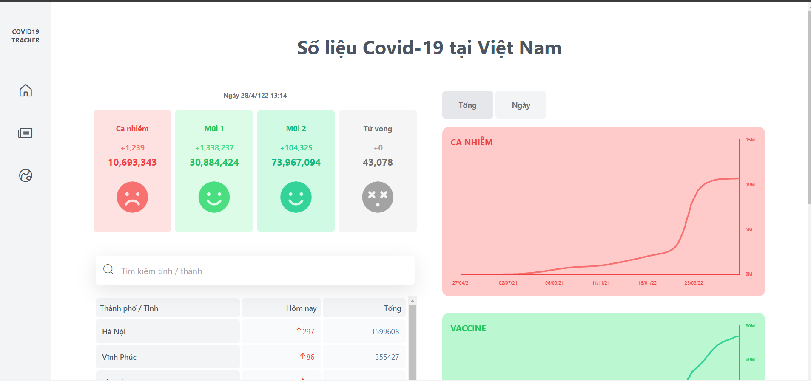

# Welcome to Covid Tracker 👋


> Project is made by HTML, CSS, TailwindCSS. Project show you information about the amount of covid cases, vaccince case and death case. Moreover, it also shows news related to covid.

## Preview


### ✨ [Demo](https://covid-tracker-hoangtrung1801.vercel.app/)

## Run

```sh
yarn install
```
```sh
yarn && yarn preview
```

## Author

👤 **hoangtrung1801**

* Github: [@hoangtrung1801](https://github.com/hoangtrung1801)

## Show your support

Give a ⭐️ if this project helped you!


***
_This README was generated with ❤️ by [readme-md-generator](https://github.com/kefranabg/readme-md-generator)_
